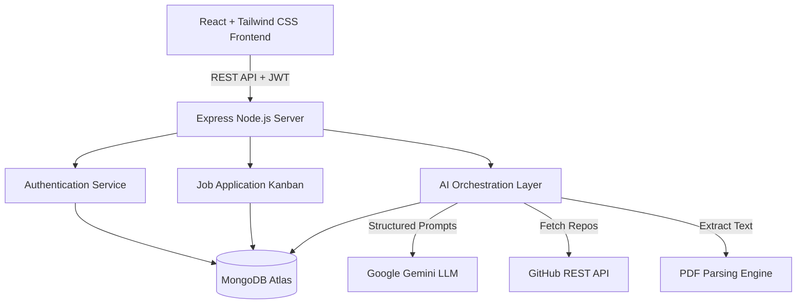

# 🚀 Smart Placement Tracker AI 
**An Agentic AI Career Operating System**

[](https://smart-placement-tracker-liard-seven.vercel.app/)
[](https://ai.google.dev/)

Smart Placement Tracker AI is a production-grade, full-stack application that transforms the traditional placement preparation process into an intelligent, data-driven workflow. Built with the **MERN stack** and deeply integrated with **Google Gemini's LLM**, this platform operates as a suite of autonomous AI agents designed to evaluate, coach, and optimize a candidate's career profile.

🌍 **Live Demo:** [https://smart-placement-tracker-liard-seven.vercel.app/](https://smart-placement-tracker-liard-seven.vercel.app/)

---

## 🧠 AI Agent Workflows (Proof of Work)

This platform moves beyond basic wrappers by implementing specialized LLM prompts and agentic workflows to handle complex career-building tasks:

*   **🕵️ ATS Semantic Matcher (V2)**: Uses semantic analysis to evaluate a PDF resume against a target Job Description. It bypasses simple keyword matching to deeply analyze context, generating a 1-100 fit score and identifying critical missing skills.
*   **💻 AI GitHub Analyzer**: Simulates a senior engineering manager. It takes a GitHub profile URL, fetches metadata, and uses the LLM to review the candidate's code quality, architecture choices, and documentation rigor.
*   **🎙️ AI Interview Coach**: A dynamic chat interface where the LLM acts as a strict technical interviewer. It provides real-time feedback on user responses and adapts questions based on the candidate's target role.
*   **🗺️ AI Roadmap Generator**: Dynamically generates a weekly, structured learning path customized to the user's current skill gaps and target job role.
*   **✉️ AI Cover Letter Engineer**: Ingests resume context and job requirements to author highly personalized, non-generic cover letters that highlight relevant past experiences.

---

## 🏗️ System Architecture



### ⚡ Technical Stack
*   **Frontend**: React (Vite), Tailwind CSS, React Router (Vercel Deployed)
*   **Backend**: Node.js, Express, JSON Web Tokens (JWT) (Render Deployed)
*   **Database**: MongoDB Atlas (Mongoose ODM)
*   **AI Integration**: `@google/generative-ai` (Gemini Flash Lite for speed & cost efficiency)
*   **Parsing**: `pdf-parse` for resume ingestion

---

## 🛠️ Prompt Engineering & LLM Strategy
To ensure the AI agents return reliable, structured data (rather than conversational text), the backend employs robust prompt engineering techniques:
*   **Forced JSON Formatting**: Prompts are designed to strictly enforce JSON schemas. The backend uses custom parsing utilities to strip markdown wrappers and safely parse the output.
*   **Model Fallbacks**: The AI controller implements a graceful degradation strategy. It attempts to use `gemini-flash-lite-latest` for low latency, and automatically falls back to `gemini-flash-latest` during rate limits (429) or high-load (503) errors.
*   **Context Injection**: The LLM is injected with parsed resume data (`req.user`) securely retrieved from the database, giving the AI continuous context across different tools without requiring re-uploads.

---

## 🚀 Local Development Setup

### 1. Clone the repository
```bash
git clone https://github.com/upamkuma/smart-placement-tracker.git
cd smart-placement-tracker
```

### 2. Backend Setup
```bash
cd server
npm install
```
Create a `.env` file in the `/server` directory:
```env
PORT=5001
MONGO_URI=your_mongodb_connection_string
JWT_SECRET=your_jwt_secret
GEMINI_API_KEY=your_google_gemini_api_key
```
Start the backend server:
```bash
npm run dev
```

### 3. Frontend Setup
```bash
cd ../client
npm install
```
Start the Vite development server:
```bash
npm run dev
```

---
*Built as a Proof of Work for modern AI-driven application development.*
